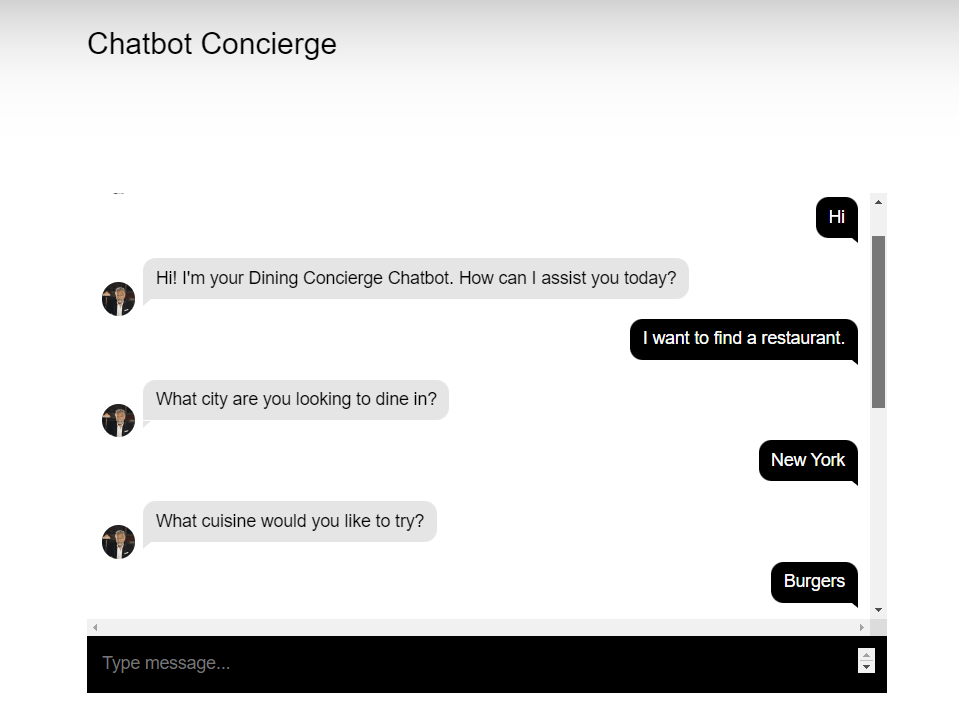
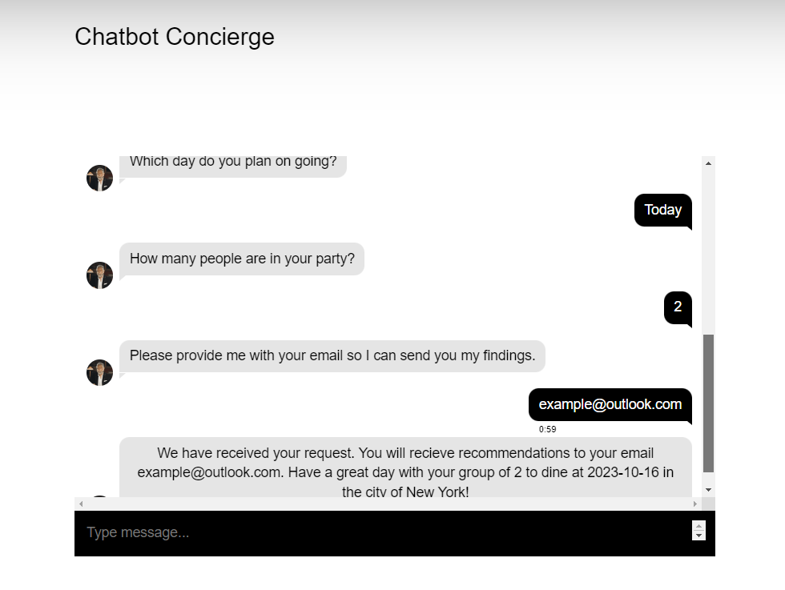
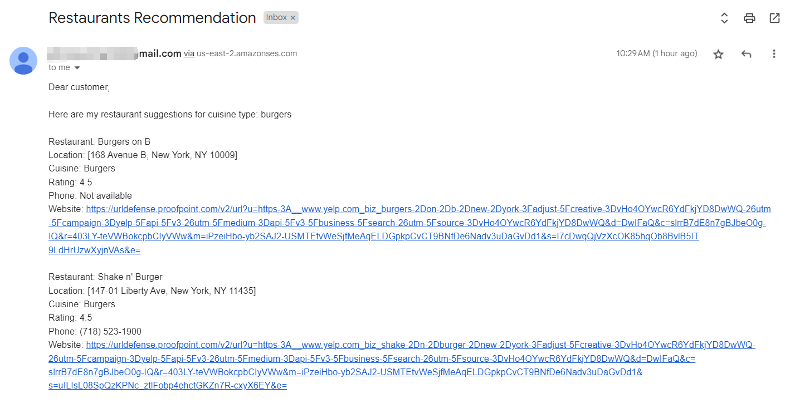

# Dining Concierge Chat bot With AWS #

<!-- ABOUT THE PROJECT -->
## About The Project
This project implemented a dining concierge chatbot which will recommend proper restaurants at certain location with certain cuisines demanded by customers. The chatbot will receive the customer's dining intent and send emails to customers with recommended restaurants.

### Built With

This project mainly used services provided by AWS.

1. S3
2. API Gateway
3. Lambda Function
4. Lex
5. SQS
6. SES
7. DynamoDB
8. OpenSearch

### Project Architechture Diagram

(<a href="#readme-top">back to top</a>)

<!-- USAGE EXAMPLES -->
## Usage
Video Demo Link: [Video_Demo](https://www.youtube.com/watch?v=GfsC0Sp8PfY)

When users open the chat bot, it will greet you and ask you about the place, cuisine type, number of people and date of your meal. By answering questions one by one, users' intent will be recorded by the chatbot. Later the chatbot will send 5 random restaurant recommendations to the customer's email address. Please follow interaction examples below so that you will be treated properly by the chat bot.

***Check your spam folder if you don't receive the email.***

Supported Cuisine types are:

                "african", "new american", "traditional american", "asian fusion", "australian", "barbeque",
                "breakfast brunch", "buffets", "burgers", "cafes", "caribbean", "chicken shop",
                "chicken wings", "chinese", "hotdogs", "Fish & Chips", "french", "german",
                "hawaiian", "hotdog", "indian ", "italian", "japanese", "korean",
                "mexican", "middle eastern", "noodles", "pizza", "salad", "sandwiches",
                "seafood", "soup", "spanish", "steak", "sushi", "thai",
                "turkish", "vegan", "vietnamese"

### Interaction Example

Chatbot Screenshot 1

Chatbot Screenshot 2

Recommendation Email Sample

(<a href="#readme-top">back to top</a>)

<!-- CONTRIBUTING -->
## Contributing

Contributions are what make the open source community such an amazing place to learn, inspire, and create. Any contributions you make are **greatly appreciated**.

If you have a suggestion that would make this better, please fork the repo and create a pull request. You can also simply open an issue with the tag "enhancement".
Don't forget to give the project a star! Thanks again!

1. Fork the Project
2. Create your Feature Branch (`git checkout -b feature/AmazingFeature`)
3. Commit your Changes (`git commit -m 'Add some AmazingFeature'`)
4. Push to the Branch (`git push origin feature/AmazingFeature`)
5. Open a Pull Request

(<a href="#readme-top">back to top</a>)

<!-- CONTACT -->
## Contact

Letian Jiang (Email: lj2397@nyu.edu)

Shihui Huang (Email: sh4480@nyu.edu)

Project Link: [Dining Concierge Chatbot](http://diningconcierge-chatbot.s3-website.us-east-2.amazonaws.com/)

(<a href="#readme-top">back to top</a>)

<!-- ACKNOWLEDGMENTS -->
## Acknowledgments

The following recourses helped me to complete this project.

* [Yelp API](https://docs.developer.yelp.com/docs/fusion-intro)
* [AWS DOC SDK Examples](https://github.com/awsdocs/aws-doc-sdk-examples/tree/main)

(<a href="#readme-top">back to top</a>)

<!-- MARKDOWN LINKS & IMAGES -->
<!-- https://www.markdownguide.org/basic-syntax/#reference-style-links -->
